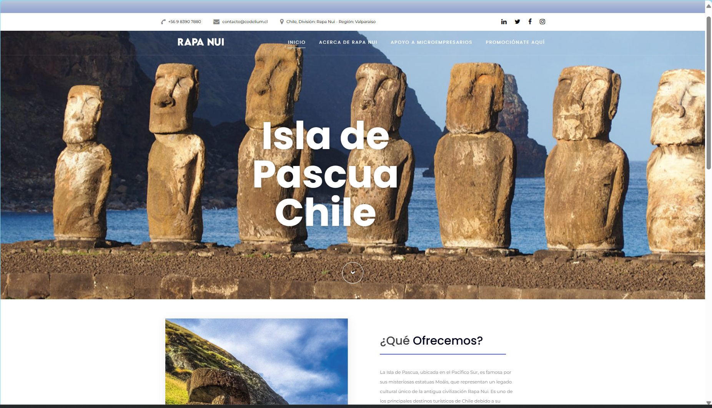

# Isla de Pascua (Chile)

## Presentación del PY

##  

## Descripción del PY ⌨️

Desarrollar página web para la Isla de Pascua (Chile), con el objetivo de promocionar e impulsar a los microempresarios de la Isla en sus emprendimientos para la sostenibilidad de la misma.
Con equipo intermultidisiplinario de la empresa Codelium se desarrolla esta proyecto de acuerdo con los requerimientos y/o necesidades de la Isla.

## Requerimientos entregados:

1. Diseño de la página web del PY Isala de Pascua (Chile).
2. Implementación del Frontend y Backend.
3. Promoción de microempresarios con sus emprendimientos.

##  

## Tecnologías Usadas 🛠️

- **Backend:** Node.js, Express.js, File System. 🧑‍💻
- **Frontend:** HTML, CSS, Bootstrap, Axios. 📚
- **Almacenamiento:** Archivo JSON (repertorio.json). 🫙

---

 

## Autores 👨‍💻

**Fundadore, Co-fundadores, Equipo de Diseño y Equipo de Desarrollo de la empresa Codelium⚡**

Sígueme en mis redes sociales: 
 
